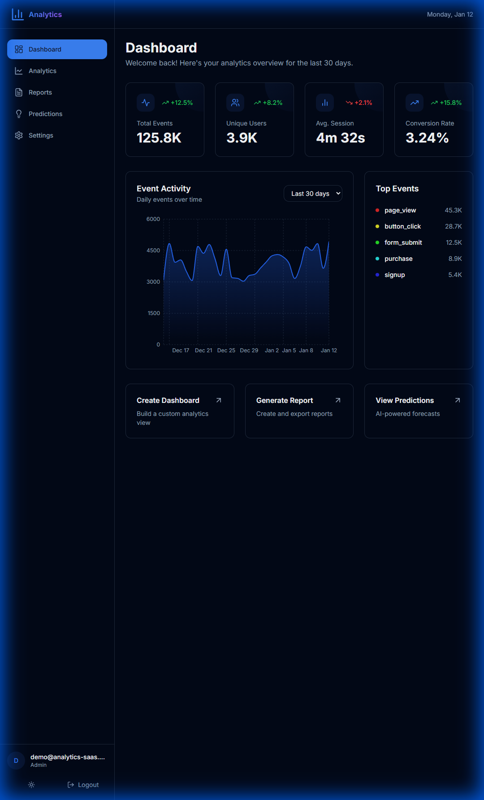
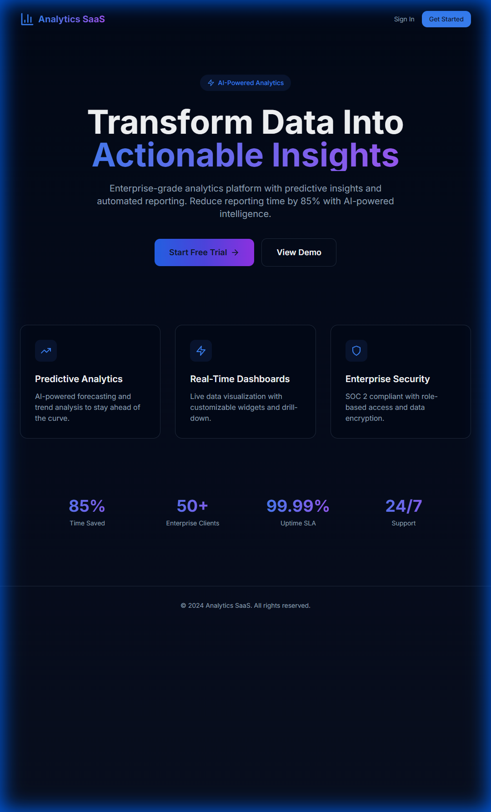
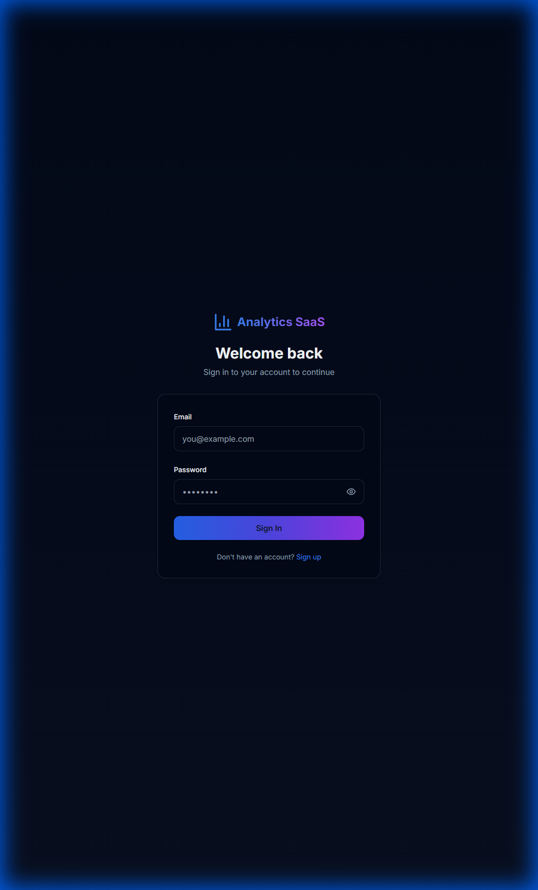
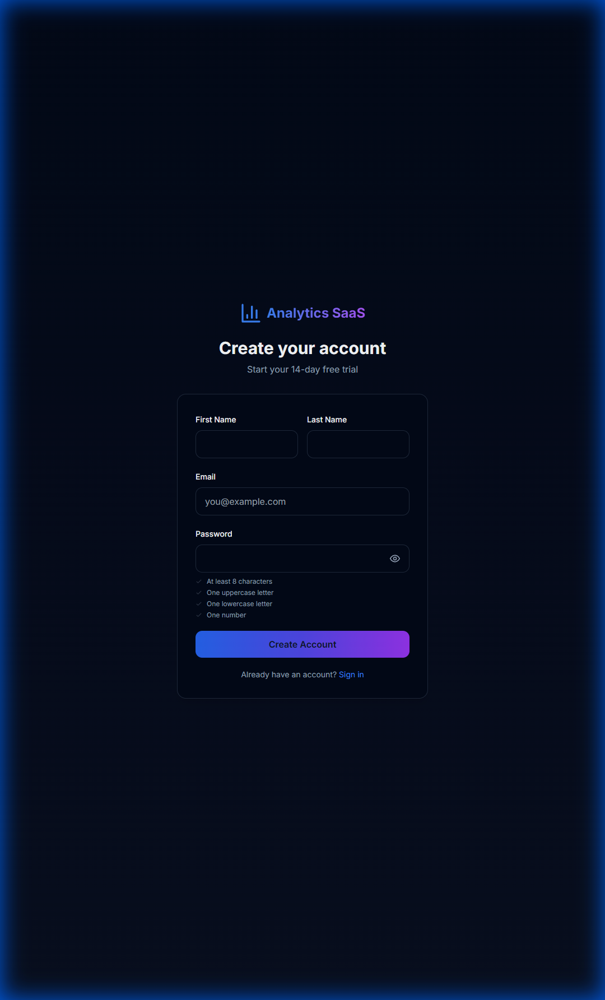

# Analytics SaaS Platform

Enterprise-grade AI-powered analytics platform with predictive insights and automated reporting.

## Tech Stack

| Layer | Technology |
|-------|------------|
| Frontend | Next.js 14 (App Router), React 18, TypeScript, Tailwind CSS, Shadcn/UI |
| Backend | NestJS 10, TypeScript, TypeORM, Bull (Job Queue) |
| Database | PostgreSQL 16 (Primary), Redis 7 (Cache/Sessions) |
| Infrastructure | Docker, Kubernetes, Nginx Ingress |
| Monitoring | Prometheus, Grafana, Loki, Jaeger |
| ML/AI | OpenAI API / Google Vertex AI (Hybrid) |


## UI Showcase

### Dashboard Overview

*Real-time analytics overview with key metrics and interactive charts*

### Landing Page

*Modern, high-converting landing page with feature highlights*

### Authentication
<div style="display: flex; gap: 10px;">
  
  
</div>
*Secure authentication flow with real-time validation*

## Project Structure

```
analytics-saas/
├── backend/                 # NestJS API server
│   ├── src/
│   │   ├── auth/           # Authentication & RBAC
│   │   ├── tenants/        # Multi-tenancy
│   │   ├── analytics/      # Core analytics
│   │   ├── reports/        # Automated reporting
│   │   ├── predictions/    # ML integration
│   │   ├── dashboards/     # Dashboard management
│   │   ├── cache/          # Redis caching
│   │   └── jobs/           # Background jobs
│   └── Dockerfile
├── frontend/               # Next.js application
│   ├── src/
│   │   ├── app/           # App Router pages
│   │   ├── components/    # UI components
│   │   └── lib/           # Utilities
│   └── Dockerfile
├── k8s/                    # Kubernetes manifests
│   ├── base/
│   ├── backend/
│   ├── frontend/
│   ├── postgres/
│   ├── redis/
│   └── monitoring/
├── docker-compose.yml      # Local development
└── .env.example           # Environment template
```

## Quick Start

### Prerequisites
- Docker & Docker Compose
- Node.js 20+ (for local development)
- pnpm (recommended) or npm

### Development Setup

```bash
# Clone and setup
git clone <repository-url>
cd analytics-saas

# Copy environment variables
cp .env.example .env

# Start all services
docker-compose up -d

# Access applications
# Frontend: http://localhost:3000
# Backend API: http://localhost:4000
# API Docs: http://localhost:4000/api/docs
```

### Manual Setup (Without Docker)

```bash
# Backend
cd backend
pnpm install
pnpm run migration:run
pnpm run start:dev

# Frontend (new terminal)
cd frontend
pnpm install
pnpm run dev
```

## Environment Variables

See `.env.example` for all required variables.

| Variable | Description |
|----------|-------------|
| `DATABASE_URL` | PostgreSQL connection string |
| `REDIS_URL` | Redis connection string |
| `JWT_SECRET` | Token signing secret |
| `JWT_EXPIRES_IN` | Token expiration time |
| `OPENAI_API_KEY` | OpenAI API key for predictions |

## API Documentation

Interactive API documentation available at `/api/docs` when the backend is running.

## License

MIT License - see [LICENSE](LICENSE) for details.
